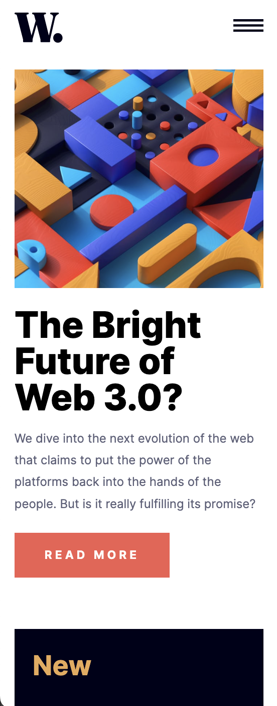

# Frontend Mentor - News homepage solution

This is a solution to the [News homepage challenge on Frontend Mentor](https://www.frontendmentor.io/challenges/news-homepage-H6SWTa1MFl). Frontend Mentor challenges help you improve your coding skills by building realistic projects. 

## Table of contents

- [Overview](#overview)
  - [The challenge](#the-challenge)
  - [Screenshot](#screenshot)
  - [Links](#links)
- [My process](#my-process)
  - [Built with](#built-with)
  - [What I learned](#what-i-learned)
- [Author](#author)


## Overview

### The challenge

Users should be able to:

- View the optimal layout for the interface depending on their device's screen size
- See hover and focus states for all interactive elements on the page

### Screenshot





### Links

- Solution URL: [https://github.com/mcorusa/news-homepage-main](https://github.com/mcorusa/news-homepage-main)
- Live Site URL: [https://mcorusa.github.io/news-homepage-main/](https://mcorusa.github.io/news-homepage-main/)

## My process

### Built with

- Semantic HTML5 markup
- CSS custom properties
- Flexbox
- CSS Grid
- Mobile-first workflow

### What I learned

I've learnt how to toggle mobile menu display by klicking on item.


```html
<h1>Some js code I'm proud of</h1>

```
```js
 menuIcon.addEventListener('click', function() {
    mobileMenu.classList.toggle('open');
    closeIcon.classList.toggle('open');
    
  });
```


## Author

- Frontend Mentor - [@mcorusa](https://www.frontendmentor.io/profile/mcorusa)

